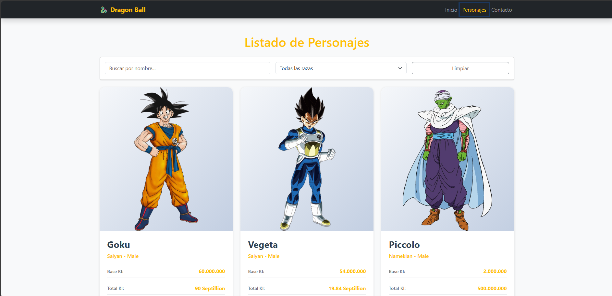
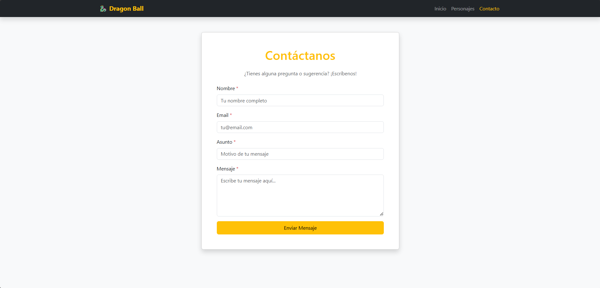

# 🐉 Dragon Ball Characters App

Aplicación web React que consume la API pública de Dragon Ball para mostrar información detallada sobre personajes de la serie.

## 📋 Descripción

Esta aplicación permite explorar el universo de Dragon Ball mediante tres páginas principales:
- **Home**: Página de inicio con personajes destacados
- **Listado**: Catálogo completo con búsqueda, filtros y paginación
- **Contacto**: Formulario de contacto con validación

## 🚀 API Utilizada

[Dragon Ball API](https://web.dragonball-api.com/) - API REST que proporciona información sobre personajes, transformaciones y más del universo Dragon Ball.

**Endpoints utilizados:**
- `GET /api/characters` - Obtener listado de personajes
- `GET /api/characters?page={page}&limit={limit}` - Paginación
- `GET /api/characters?name={name}` - Búsqueda por nombre

## 🛠️ Tecnologías Utilizadas

- **React** (v18+) - Biblioteca de JavaScript
- **React Router DOM** (v6) - Navegación entre páginas
- **Axios** - Cliente HTTP para peticiones
- **Bootstrap 5** - Framework CSS para diseño responsive
- **React Hooks** - useState, useEffect, custom hooks

## 🌐 Demo en Vivo

Puedes probar la aplicación aquí:  
[https://dragonball-app-7.netlify.app/](https://dragonball-app-7.netlify.app/)

## 📦 Instalación y Ejecución

### Prerequisitos
- Node.js (v14 o superior)
- npm o yarn

### Pasos

1. Clonar el repositorio:
   ```sh
   git clone https://github.com/syderkkk/dragonball-app.git
   cd dragonball-app
   ```

2. Instalar dependencias:
   ```sh
   npm install
   ```

3. Ejecutar en modo desarrollo:
   ```sh
   npm start
   ```

4. Abrir el navegador en:  
   [http://localhost:5173](http://localhost:5173)

## 📁 Estructura del Proyecto

```
src/
├── components/         # Componentes reutilizables
│   ├── Navbar/
│   ├── Card/
│   ├── Pagination/
│   ├── SearchBar/
│   ├── Loading/
│   └── ErrorMessage/
├── pages/              # Páginas principales
│   ├── Home/
│   ├── Lista/
│   ├── Contacto/
│   └── NotFound/
├── services/           # Configuración de Axios y servicios
│   ├── axios.config.js
│   └── characterService.js
├── hooks/              # Custom hooks
│   └── useCharacters.js
├── utils/              # Utilidades
│   └── validation.js
└── App.js              # Componente principal
```

## ✨ Características

### Routing
- ✅ BrowserRouter implementado
- ✅ 4 rutas (Home, Lista, Contacto, 404)
- ✅ Navbar con enlaces activos

### Fetching de Datos
- ✅ Instancia base de Axios configurada
- ✅ Servicios modulares separados
- ✅ Custom hook `useCharacters`
- ✅ Manejo de estados: loading, error, data
- ✅ Interceptores para errores globales

### Paginación y Filtros
- ✅ Paginación del lado del servidor
- ✅ Filtro por nombre en tiempo real
- ✅ Filtro por raza/categoría
- ✅ Persistencia de filtros en URL (query params)
- ✅ Selector de items por página (10, 20, 50)
- ✅ Botones Previous/Next
- ✅ Información "Página X de Y"

### UI/UX
- ✅ Diseño responsive (mobile, tablet, desktop)
- ✅ Loading states con spinners
- ✅ Mensajes de error claros
- ✅ Feedback visual en interacciones
- ✅ Cards con efecto hover
- ✅ Formulario con validación en tiempo real

### Formulario de Contacto
- ✅ Validación de nombre (mín 3 caracteres)
- ✅ Validación de email (formato válido)
- ✅ Validación de asunto (requerido)
- ✅ Validación de mensaje (mín 10 caracteres)
- ✅ Mensajes de éxito/error
- ✅ Limpieza automática tras envío

## 📸 Capturas de Pantalla

### Home


### Listado de Personajes


### Contacto


## 📄 Licencia

Este proyecto es de código abierto y está disponible bajo la licencia MIT.